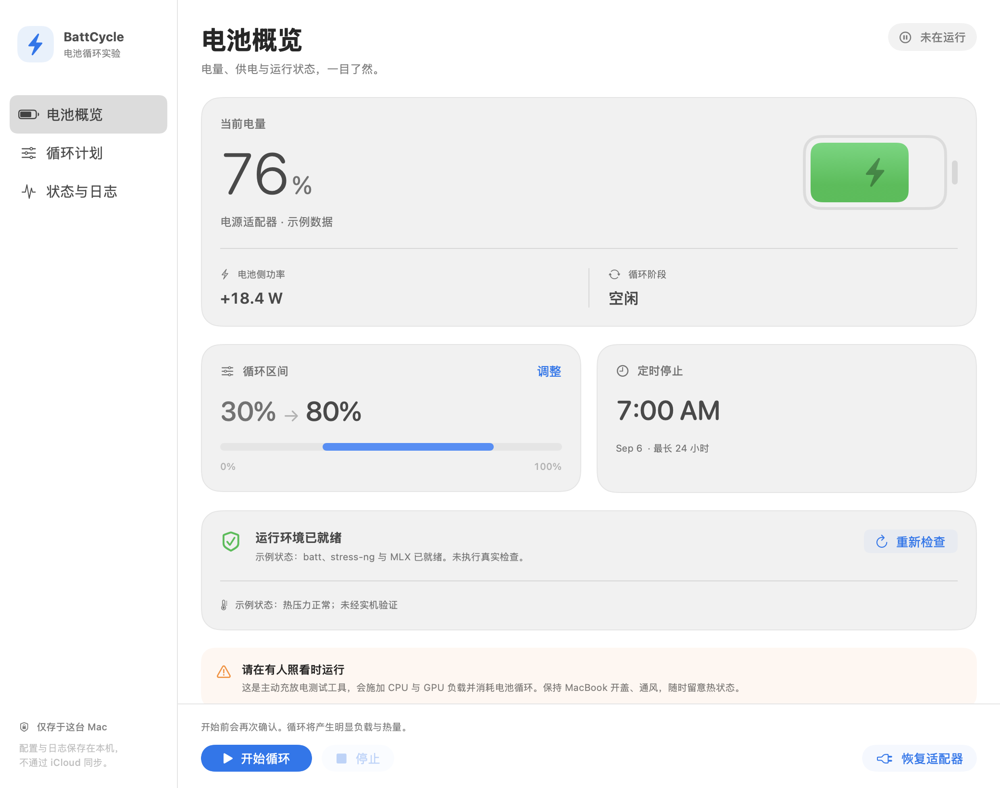

# BattCycle

Deliberate battery cycling and high-load testing for Apple Silicon MacBooks.

[](https://github.com/AlfWuxy/BattCycle/actions/workflows/ci.yml)
[](LICENSE)
[](https://support.apple.com/macos)

BattCycle deliberately accelerates MacBook battery cycling. When the battery reaches an upper threshold, it temporarily disables adapter power and runs sustained CPU and GPU workloads. At the lower threshold, it stops the workloads, restores charging, and repeats until the scheduled deadline.

It is built for supervised battery-wear, power-response, and thermal-response experiments. Repeated cycling consumes cycle life, produces heat, and can reduce battery health faster.

[View the source release](https://github.com/AlfWuxy/BattCycle/releases/tag/v0.1.0) · [Report a bug](https://github.com/AlfWuxy/BattCycle/issues/new?template=bug.yml) · [Suggest an idea](https://github.com/AlfWuxy/BattCycle/issues/new?template=feature.yml)

> [!CAUTION]
> Use BattCycle only while you can supervise the Mac. Save open work, keep the lid open, place the Mac on a hard ventilated surface, and read [SAFETY.md](SAFETY.md) before the first run.

## Who it is for

- Developers testing power behavior under repeatable load.
- Hardware experimenters studying battery wear and charge/discharge timing.
- Performance testers comparing CPU-only, GPU-only, and combined load behavior.
- Owners who intentionally want to consume battery cycles for a controlled experiment.

BattCycle is a test tool. It does not improve battery lifespan, capacity, calibration, or everyday charging habits.

## What it does today

- Configures upper and lower battery thresholds.
- Uses the separately installed [batt](https://github.com/charlie0129/batt) daemon to disable adapter power for bounded intervals.
- Runs `stress-ng` CPU work and an MLX GPU matrix workload during discharge.
- Repeats charge and discharge phases until Stop or the scheduled deadline.
- Shows battery percentage, power source, and instantaneous battery-side watts.
- Watches the macOS thermal-pressure state and stops on serious or critical pressure.
- Provides visible Stop, Restore Adapter, logs, and timed recovery controls.

## Native macOS interface

The app uses a native sidebar for **Overview (电池概览)**, **Cycle Plan (循环计划)**, and **Status & Logs (状态与日志)**. Battery and power readings have clear unavailable states; a persistent control bar keeps Start, Stop, and Restore Adapter in reach while the detail pane scrolls. The interface follows Light and Dark appearance, supports keyboard shortcuts, and keeps running plans read-only until the cycle stops.



This is the actual SwiftUI interface rendered with **synthetic preview data**, not a hardware acceptance result. See [UI validation and additional states](docs/UI_VALIDATION.md) for Dark appearance, minimum-window layouts, error feedback, and the hardware-free preview command.

## One cycle

1. Charge toward the configured upper threshold.
2. At the upper threshold, request a timed adapter disable.
3. Run the selected CPU and GPU workloads while the battery discharges.
4. At the lower threshold, stop the workloads and restore adapter power.
5. Charge again and repeat until the deadline or a manual Stop.

The default profile cycles between 80% and 30%, uses four CPU workers and a moderate MLX matrix, and stops at the next 07:00 local time. A single run cannot exceed 24 hours.

## What it measures

| Signal | Current support |
| --- | --- |
| Battery percentage and power source | Live in the app and engine logs |
| Instantaneous battery-side power | Live signed watt reading |
| macOS thermal pressure | Nominal, fair, serious, or critical |
| Peak and average power, watt-hours | Planned run report |
| CPU/GPU component power | Planned optional collector |
| Exact battery, CPU, or GPU temperature | Not currently collected |
| Cycle count and battery-health history | Planned baseline and comparison report |
| Charger or wall-input power | Requires external measurement hardware |

The current version creates the workload and exposes live battery-side power. It does not yet produce a complete peak-power, temperature, heat-flow, or battery-health report.

## Requirements

- Apple Silicon MacBook running macOS 14 or later.
- Swift 6 toolchain for a source build.
- [batt](https://github.com/charlie0129/batt) 0.8.0 or later with regular-user daemon access.
- `stress-ng`.
- A user-local Python environment with [MLX](https://github.com/ml-explore/mlx).

The common Homebrew setup starts with:

```bash
brew install batt stress-ng python
sudo brew services start batt
mkdir -p "$HOME/Library/Application Support/BattCycle"
/opt/homebrew/bin/python3 -m venv "$HOME/Library/Application Support/BattCycle/venv"
"$HOME/Library/Application Support/BattCycle/venv/bin/python3" -m pip install --upgrade pip mlx
```

Review the official batt installation instructions before authorizing its service. BattCycle does not install, start, upgrade, or reconfigure that service for you.

## Build and use

```bash
git clone https://github.com/AlfWuxy/BattCycle.git
cd BattCycle
swift build
swift test
./scripts/battcycle doctor
/bin/zsh packaging/package_app.sh
open dist/BattCycle.app
```

In the app:

1. Wait for the environment check to pass.
2. Open **Cycle Plan (循环计划)** to choose the charge range, stop time, and optional CPU/GPU load settings.
3. Press **Start Cycle (开始循环)**, or **⌘R**, and confirm the experiment.
4. Watch the watt reading and thermal state while the Mac remains open and ventilated.
5. Use **Stop (停止)**, or **⌘.**, to end the run. Use **Restore Adapter (恢复适配器)** if power needs to be re-enabled and verified. These controls remain visible on every page; menu-bar recovery remains available when the main window is closed.

Runtime configuration and logs stay under `~/Library/Application Support/BattCycle/` and `~/Library/Logs/BattCycle/`.

## Current status

- Swift builds, tests, engine behavior, and packaging are verified with local or mocked checks.
- The public `v0.1.0` release contains source code. A notarized binary is not published yet.
- A supervised real-adapter hardware acceptance run has not yet been completed for `v0.1.0`.
- iPhone support is a roadmap item. No iPhone app or cross-device control ships today.

Automated tests never disable a real adapter or launch a real stress workload.

## Product direction

The next useful step is to turn each run into a reproducible experiment report:

- Time-series samples for battery watts, charge level, phase, thermal pressure, and workload settings.
- Peak, stable average, watt-hour estimate, phase duration, and completed-cycle summaries.
- Start/end battery-health baselines and comparison history.
- Separate **Cycle Burn**, **Power Sweep**, and **Thermal Soak** experiment modes.
- CSV/JSON export and a read-only iPhone status companion.

## Technical docs

- [Product requirements](docs/PRD.md)
- [Architecture and trust boundaries](docs/ARCHITECTURE.md)
- [Safety and recovery](SAFETY.md)
- [Privacy](docs/PRIVACY.md)
- [Asset provenance](docs/ASSET_PROVENANCE.md)
- [Contributing](CONTRIBUTING.md)
- [Security policy](SECURITY.md)

## License

BattCycle source code is available under the [MIT License](LICENSE). See [asset provenance](docs/ASSET_PROVENANCE.md) for non-code asset status.
